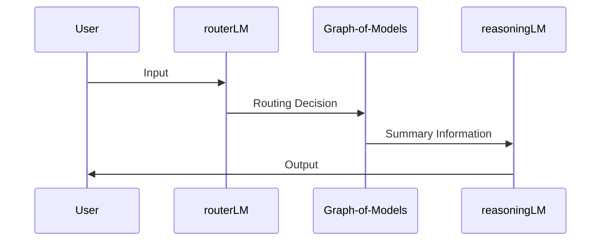

After hopeless moments, I think I figure a prototype idea for my work. Everything is less and less vague. Even though the limitations seem clear but if it can serve the final purpose, it is good.

## First Draft


My first proposed structure.

The structure is simple, there are 3 main parts:
- Input Processing
- Graph-of-Models
- Output Processing

There are 2 major problems we need to encounter:
- How we shape the graph?
- How it will run?

The limitation of this work is the complexity to make the graph or input processing, and there is a concern about extending the graph. So there must be a sustainable method to make the algorithm of making graph brilliant and less hand-work.

## First Idea

How to solve those 3 problems is a problem. I don't know if I should read some papers about Multi-Agent AI @@.

### How we shape the graph?


My imagination on how the graph should looks like. It's something like Dijkstra graph .

To shape the graph, we need to calculate the relationship between the models which is based on the **datasets we used to fine-tune**.

To calculate this number like in the diagram above, there are some options that I am not sure which one is the best:
- **Jaccard Index** : This method seems faster to run, run on the raw dataset.
- **Cosine Similarity** : This method seems slower as I need to convert the dataset into embeddings to calculate.

There are more advanced methods but I don't have time to dig deeper yet. I think I will apply 2 classic methods first to see the efficiency.

The score will be stored and called **relevancy score**.

### How it will run?


My workflow I propose in this post :)

- **Step 1**: User will **input** his requirement.
- **Step 2**: `routerLM` will choose the most relevant model based on **input** (inspired from ).
- **Step 3**: In this step I first plan to run sequencely, but there is a work hinting we can run parallel .
  - Extract **general info** about the input in `sharingModel`.
  - Use suitable PROMPT to extract **relevant info** from **most relevant model**, let call `miniModel_1` (step 2) and **2nd model** has **highest relevance score** to `miniModel_2`, let call this model is `miniModel_2`.
- **Step 4**: **general info** + **relevant info** will be sent to `reasoningModel` to give final output.

## First Step

> 2 goals: Fine-tuned model and graph visualization

Here is my collection of the models and datasets I collect for this project: [vtrnnhlinh's Collection: Graph-of-Models](https://huggingface.co/collections/vtrnnhlinh/graphs-of-models-686f8bfc6070ec6ad9111fff).

I plan to make a graph of models finetuned related to food, with the datasets about fruits, recipes and drinks. I choose small models to do, cause my personal laptop has limited resources lol. 

After that, I will calculate **Jaccard Index** and **Cosine Similarity** and visualize the graph with its relation score. 

---

I think this "first step" is already a huge problem to a noob like me already, lol.

Look forward to share next things :>
