This will be a mixture of theory and real-life experience. When I type this line, god knows what I am doing. Unlike previous times, I jump into doing immediately like blind in the darkness, even though I made progress and basically *it runs!*. But I feel like I am missing a lot of powerful points in this concept, so I write this post, to force myself systemize the *shiet* I am doing.

## The Theory and The Idea

**GraphRAG** is the work of Microsoft , it can be described like below:

```mermaid
graph TD
    A[🤖 Use LLM to Construct Knowledge Graph from Data/Text] --> B[🗂 Partition Graph into Hierarchical Communities]
    B --> C[📝 Use LLM to Generate Summaries for Each Community]
    C --> D[📦 Store Community Summaries in Vector Store]
    D --> E[❓ Receive User Query]
    E --> F[🔍 Retrieve Relevant Community Summaries via Semantic Search]
    F --> G[🗺 Map-Reduce Reasoning: Map → Process Each Summary Independently]
    G --> H[🧠 Reduce → Aggregate & Refine Answers]
    H --> I[✅ Return Final Answer to User]
    
    I -->|Feedback/Refinement| A
```

To me, the hardest point of this work is graphing the knowledge graph, which is heavier about the technique, not the idea.

## ramblin' ramblin'

In my mindset, RAG has 3 steps: prepare the database, retrieve the data and reasoning with the data. This post only shares 2 first step, as the last step maybe involves other's work. I will talk vaguely about last one in the **retrievin' the graph** section.

### shapin' the graph

At this very moment, I have my graph already~, we use [neo4j](https://neo4j.com/) to become our graph database service.

I use `localhost`, virgin uses cloud service, chad uses localhost :wink:

We will show final result first, to show some aesthetic :sparkles: 



My Knowledge Graph and nodes on `neo4j`

To do this, I am inspired by `edc`  to extract the information step-by-step. I create a simpler python file to run as modifying other code is still over of my current abilities. There are some problems like wrong variable names as I use a general model like [`Qwen3-8B`](https://huggingface.co/Qwen/Qwen3-8B). It automatically fixed the variable to make it more "sense". I don't apply the usual process, like I didn't have the schema file even though I define something similar to it.

Yap yap yap bla bla bla. There are suggestions that `neo4j` have native supports to shape a Knowledge Graph, but I wonder if it's applicable for unprocessed data like what I was working at.

### retrievin' the graph

The main tools to use in this part is `langchain` and `chromadb`. We use `langchain` functions to generate the suitable Cypher command fetching data from `neo4j` database. `chromadb` is used to saved retrieved data, help modularizing the pipeline. 

Here is the basic workflow:

```mermaid
graph TD
    A[❓ User Question] --> B[📝 Build Prompt with Schema & Examples]
    B --> C[🤖 LLM Generates Cypher Query]
    C --> D[🔍 Sanitize & Validate Query]
    D --> E[🔗 Execute Query in Neo4j]
    E --> F[📥 Get Results]
    F --> G[💽 Store in ChromaDB]
```

The challenges of this part is the suitable Cypher example to help the LLM generate suitable Cypher command with the input. I use `SemanticSimilarityExampleSelector` but god knows which method is more effective in my case. Currently the result isn't so stable. Still needs to figure out because of stupid model or too little examples.

This is the workflow of final stage:

```mermaid
graph TD
    A[❓ Input Question] --> B[🔍 Retrieve Relevant Data from ChromaDB]
    B --> C[📚 Combine Retrieved Data with Knowledge Base]
    C --> D[🤖 Reasoning / Generate Answer]
    D --> E[✅ Output Final Answer]
```

---

Latest note: It seems I am missing a lot of powerful tools, will figure out to apply!
