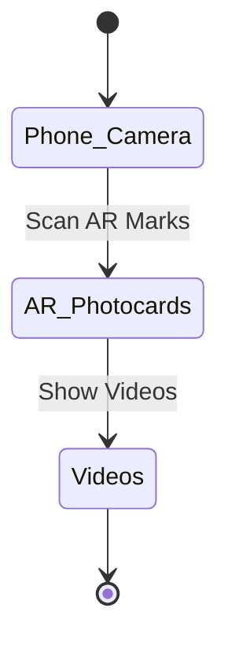
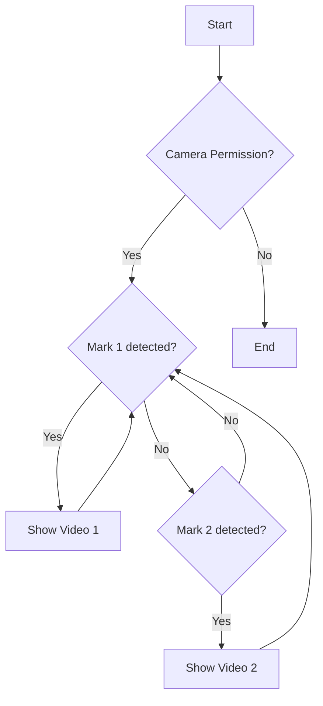

This is the first coding product project I ever made. I don't like web development, but sometimes, it's the optimized approach to your problem.

## Introduction

Freebies is a crucial part of ATVNCG community, but an impressive one is a whole problem. How do we make the freebies worth keeping?

Our main goal is sending a message from our idol to the fans. To reach the goal, we decide to use Augmented Reality technology.

The idea is when you scan the AR mark on the card, a video will pop up and play.



## Objectives

- Videos has sound and play smoothly
- AR videos work in expected dimension and size
- Different marks show different videos

## Tech Stacks

- `arjs`, `threejs`
- Basic `HTML` and `CSS`
- GitHub page

The first, I believe a website is the most universal accessible. I have to make it most easy to use for users. I also have to minimize the cost as most as possible. GitHub page with free hosting and I have experienced is a clear good choice. The most important is the package already have examples code from [stemkoski/AR-Examples](https://stemkoski.github.io/AR-Examples/).

## Implementation

### Flowchart

The detail flowchart of this problem is like this:



### Videos and Markers

First, I create different markers image and convert to `.patt` file. Tool for create AR markers: [AR.js Marker Training](https://jeromeetienne.github.io/AR.js/three.js/examples/marker-training/examples/generator.html)

Video format is like this, notice the codecs of the video.

```html
<video
  id="thanks_for_coming"
  loop
  crossorigin="anonymous"
  webkit-playsinline
  playsinline
  style="display: none"
>
  <source src="video/cam_on.ogv" type='video/ogg; codecs="theora, vorbis"' />
  <source
    src="video/cam_on.mp4"
    type='video/mp4; codecs="avc1.64001F, mp4a.40.2"'
  />
</video>
```

### Some coding notices

I use [AR-Examples/Video](https://github.com/stemkoski/AR-Examples/blob/master/video.html) as base source. Then I remove unnecessary files.

According to Apple policy, autoplay video can't play sounds, we will find a sneak-out way by creating a waiting screen, the user has to touch the waiting screen to use the main feature.

```html
  <!-- Start Button -->
  <div id="start-button" style="position: absolute; top: 50%; left: 50%; transform: translate(-50%, -50%); padding: 10px; background: #fff; cursor: pointer; font-size: 15px">
    Chạm màn hình</br>Cho phép truy cập camera</br>Quay mặt sau của card</br>Và cùng khui sít rịt với 2212 Phố Chèo
  </div>
  ...
    document.getElementById("start-button").addEventListener("click", () => {
      // Hide the start button
    document.getElementById("start-button").style.display = "none";
```

The logic is simple like showed flowchart, the source code I will provide link at the end of the post.

## Results

The products has a lot of feedbacks on Threads, both in videos and images. I will provide links at the end of the post. Examples images:

<div class="row mt-3">
    <div class="col-sm mt-3 mt-md-0">
        
    </div>
    <div class="col-sm mt-3 mt-md-0">
        
    </div>
</div>
<div class="caption">
    Source: <a href= "https://www.threads.com/@hnm.hanh/post/DIGqJ_bTsUj?xmt=AQF0Aq88IVr3TfHBbdaUONr6HAYN6cvL4CoOV_9ecp3kww">@hnm.hanh</a> và <a href= "https://www.threads.com/@thao_sayaka/post/DIOXDfSSF-u?xmt=AQF0Aq88IVr3TfHBbdaUONr6HAYN6cvL4CoOV_9ecp3kww">@thao_sayaka</a>.
</div>

## Take-aways

There are some things I notice in this project, I am not sure about my understanding about the word 'take-aways' but let do it.

- You should keep the video as short as possible to make it stable
- Test on at least 2 different browsers on 2 different OS (Android and iOS)
- The marker should be identical, not square!!

## Future works

I am planning to make an animated 3D version of him, don't know where this project will lead to?

## Links

- **Source code**: [phocheo/AR_photocards](https://github.com/phocheo/AR/tree/master)
- **Reference code**: [stemkoski/AR-Examples](https://stemkoski.github.io/AR-Examples/)

### Feedback Videos

- [@hongphuong1111](https://www.threads.com/@hongphuong1111/post/DID_fslyygN?xmt=AQF0DMywJ7LJQkAzdu-RLNDl81PKlfpIEisKo555_OTtnw)
- [@kounek0](https://www.threads.com/@kou_nek0/post/DIDyLHVPJar?xmt=AQF0DMywJ7LJQkAzdu-RLNDl81PKlfpIEisKo555_OTtnw)
- [@doahoacoccan](https://www.threads.com/@doahoacoccan/post/DIBhNAwvZdU?xmt=AQF0DMywJ7LJQkAzdu-RLNDl81PKlfpIEisKo555_OTtnw)
- [@duyenbo198](https://www.threads.com/@duyenbo198/post/DIAiDrDzhu2?xmt=AQF0DMywJ7LJQkAzdu-RLNDl81PKlfpIEisKo555_OTtnw)
- [@maydaily_abc](https://www.threads.com/@maydaily_abc/post/DH-0QJYJI6t?xmt=AQF0DMywJ7LJQkAzdu-RLNDl81PKlfpIEisKo555_OTtnw)
- [@luuthutra](https://www.threads.com/@luuthutra/post/DHqgVakzrSs?xmt=AQF0DMywJ7LJQkAzdu-RLNDl81PKlfpIEisKo555_OTtnw)

### Feedback Images

- [@thao_sayaka](https://www.threads.com/@thao_sayaka/post/DIOXDfSSF-u?xmt=AQF0DMywJ7LJQkAzdu-RLNDl81PKlfpIEisKo555_OTtnw)
- [@hnm_hanh](https://www.threads.com/@hnm.hanh/post/DIGqJ_bTsUj?xmt=AQF0DMywJ7LJQkAzdu-RLNDl81PKlfpIEisKo555_OTtnw)
- [@nnamai_28](https://www.threads.com/@nnamai_28/post/DHnwMfahckA?xmt=AQF0DMywJ7LJQkAzdu-RLNDl81PKlfpIEisKo555_OTtnw)
