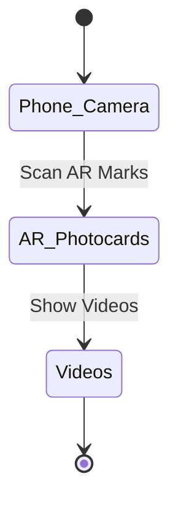

This is the first coding product project I ever made. I don't like web development, but sometimes, it's the optimized approach to your problem.

## Introduction

Freebies is a crucial part of ATVNCG community, but an impressive one is a whole problem. How do we make the freebies worth keeping?

Our main goal is sending a message from our idol to the fans. To reach the goal, we decide to use Augmented Reality technology.

The idea is when you scan the AR mark on the card, a video will pop up and play.

## Objectives

- Able to play AR Videos
- Different marks show different videos
