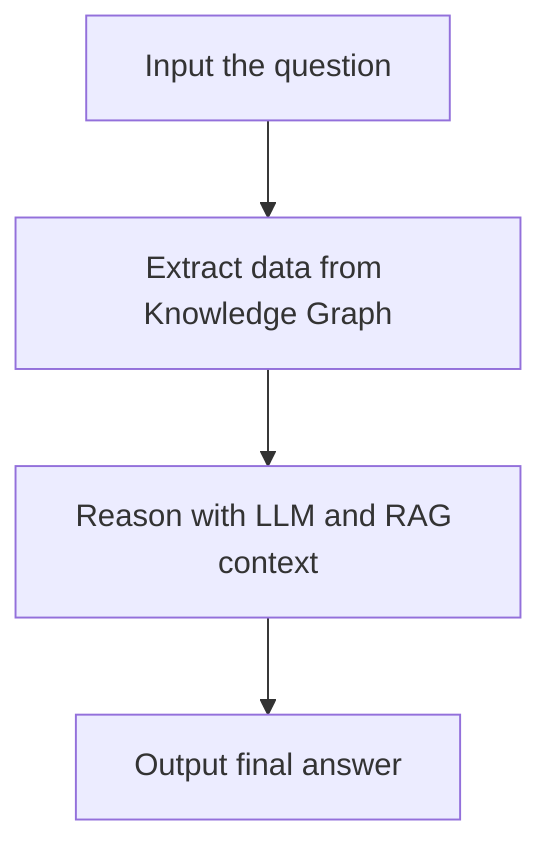

This is my solo project during my internship at BGSV. Happy to share trivia things with you about my proud work. It has some naive points but still, I am proud of it :triumph:.

## Motivation

This is a part of a AI development in my almost former company. Our AI focuses on assisting Testing in AUTOSAR system. I am assigned to tackle the question: **How the LLM can understand the relationships of components in AUTOSAR?**

To me, relationships = graph. That is the main driver leads me to GraphRAG . But because of my weird approach (read [this blog post](https://vtrnnhlinh.github.io/blog/2025/graphrag-theory-and-practice/) to find out more), maybe my GraphRAG isn't the same with Microsoft's GraphRAG.

So, when using GraphRAG, my main target is reducing *Exposure Bias* (read [this blog post](https://vtrnnhlinh.github.io/blog/2025/nlg-hallucination/) for more details). It's like providing cheat sheet for the model.

## Conceptual Overview

Oversimplify this work:



Easy, eh? But god knows it was like spagetti when I tried to modularize the code.

## Tech Stack

I think it's not necessary to say that the programming language using in this project is *Python*.

- **Knowledge Graph**: [Neo4j](https://github.com/neo4j/neo4j). It's Graph-native database makes querying easier.
- **Embedding Database**: [ChromaDB](https://github.com/chroma-core/chroma). It's open-source, solid and easy to use.
- **LLM**: Qwen3-8B . It's easy to download and implement. The benchmark is also very positive.
- **sentence embedding model**: [all-MiniLM-L6-v2](https://huggingface.co/sentence-transformers/all-MiniLM-L6-v2). This one, I use it because it is popular :>
- I use other Python packages like `torch` or `transformers`. I don't know but I have a sense hating `langchain`.
- **Environment Manager**: [Anaconda](https://anaconda.org/). Because my company uses this and I also know this. I don't think it's a superior tool but sometimes you don't need superiority that much but how others also can stay on the same page with you.

## Pipeline Breakdown

My code structure, I divide the logic into 3 parts:

- **Graph Shaping**: Focus on converting processed `.txt` files to **Neo4j Database**. The art of preprocessing the data to convert is another work, that is also a wonderful adventure but the final result is kinda prompting dependent, which is specific and provide no valuable things.
- **Graph Extraction**: Focus on having the data from **Knowledge Graph** (Neo4j Database) saved to **Embedding Database** (ChromaDB Database).
- **Graph Retrieval**: Focus on **RAG** - Retrieve RAG Context and use LLM to reason with it.

Beside that, there are helper functions I wrote to assist the pipeline. Including:

- `utils.chromadb_utils`: Some basic functions to work with ChromaDB.
- `utils.model_utils`: Reduce the effort to utilize the model, you only need to input `model_path` to use (Company's requirement makes me use local models).
- `utils.neo4j_utils`: Functions to work with Neo4j Driver and sanitize CYPHER query.
- `utils.preprocessing_utils`: Regex functions to help sanitize data and variable names.


Best effort I can draw to describe my idea :pensive:

### Graph Shaping

In my particular case, there are more than 100 `.txt` files to insert into Neo4j Database. We will use `utils.neo4j_utils` and `utils.preprocessing_utils` to work with this part. I showed the result of this part before, let me re-share :triumph:.


My Knowledge Graph and nodes on neo4j.

### Graph Extraction

The quality of this part depends heavily on the quality of `cypher_examples.json`, which is the collection of samples questions and corresponding CYPHER query. Below is examples how to use the functions of `GraphExtractor` class.

```python
cypher_ex = extractor.load_cypher_examples(cypher_examples_path)
extractor.save_cypher_examples_to_chromadb(cypher_examples_path)
question = extractor.reason_the_question(input_question, model_qwen3)
sim_ex = extractor.get_similar_examples(question, k=5)
extract_prompt = extractor.build_prompt(question, k=5)
cypher_result = extractor.generate_cypher_from_prompt(
    prompt=extract_prompt,
    model_path=model_qwen3
)
extractor.run_cypher_and_save_chromadb(
    question=question,
    cypher_cmd=cypher_result
)
```

I think the code describes clearly how this part works, I will explain `reason_the_question` because I think it's necessary. From the input from user, we will reason the input to get the question similar to the form of the questions in `cypher_examples` to improve the quality of generating CYPHER query. Why I don't take directly from user's input to generate CYPHER query? Because it will provide flexibility when you change the input (as we work on various types of testing), you don't need to re-prepare a whole `cypher_examples` file. You just need to modify the prompt. And again, our model is kinda small and we can't accept "almost" true CYPHER query, it simply won't run if missing a single character or whatsoever. So simplify the question will help stabilize the output of CYPHER query.

### Graph Retrieval

This part works like basic RAG technique, there is nothing much to share. Below is example code to demonstrate the functions of `GraphRetriever` class.

```python
retriever = GraphRetriever(collection_name="neo4j_results")
retriever.load_models(
    embedding_model_path="sentence-transformers/all-MiniLM-L6-v2",
    llm_model_path=model_vmeai,
    device="cuda"
)
rag_context = retriever.build_rag_content_from_chromadb(k=5)
final_prompt = f"Answer the user’s question in detail:\n\n{input_question}"
rag_answer = retriever.generate_rag_answer(final_prompt, rag_context)
print("=== Final RAG Answer ===\n", rag_answer)
```

I use **TopK** technique to retrieve data from ChromaDB Database (default k = 5). There is nothing impressive.

## Challenges

- **My limited Python skill**: Unlike C/C++, I have no ideas how they modularize Python code. In C/C++, we have header files `.h` and source files `.c`, but in Python? I don't know, I don't have any ideas and don't know where to start. I don't have time to follow tutorials step by step like before. My solution is reference other Python repositories and ask ChatGPT for help :rofl:. I think I did it.
- *Set sail! I am the captain!* My team doesn't have anyone specialized in Machine Learning or Data Science, we are a gang of Embedded Systems :sunglasses:. My mentor isn't very skilled in this field, and people are busy of their own tasks. So I have to swim on my own :rofl:. It's both fantastic that I kinda have a strong personality, I love the feeling of diggin' on my own. The bad side is I usually lost and don't know what to do :laughing:.
- **The vagueness of expected output**: Because the idea using GraphRAG I research and develop on my own, so I ain't assigned a particular output and I don't have access to the output prompt of current AI workflow, that makes me hard to compare the output with and without GraphRAG. I decide to measure by sensing the understanding of pre-fined model (Qwen3-8B) and fine-tuned model with the RAG data.
- **Submitting job on HPC clusters**: Want to run code using GPU, I have to submit job through LSF (Load Sharing Facility). I have problems with Neo4j Database. I can't access Neo4j Database in the first tries. I discover that I can't simultaneously open Neo4j server on my local Red Hat environment and the submitted job. That made I have to delete and re-unzip Neo4j some times. After that I always close the server on my local before submitting job. And with the `.bsub` file using Neo4j, I have to setup JAVA Environment, open server, run python files and close server at the end of the job.

## Results

I can't share results cause I sense it violates the policy of my company. But I can say that the generating CYPHER query is stable and the model now can grab the sense and how variables of this component affect to another component.

That means it works, but how much effective in numbers, it's pure out of my scope to measure.

## Future Ideas

In my work, I sense some limitations and space for development.

- Is **TopK** taking from ChromaDB (collection: *neo4j_results*) suitable? Does it kill the idea and power of Graph?
- In the future, when we applying RLHF, how we can retrieve another branch if the feedback isn't good?
- Because of Neo4j License problem for Commercial, is there any cheaper solution with similar functions?

## Interesting Links

- [microsoft/graphrag](https://github.com/microsoft/graphrag)
- [clear-nus/edc](https://github.com/clear-nus/edc)
- [pat-jj/KG-FIT](https://github.com/pat-jj/KG-FIT)
